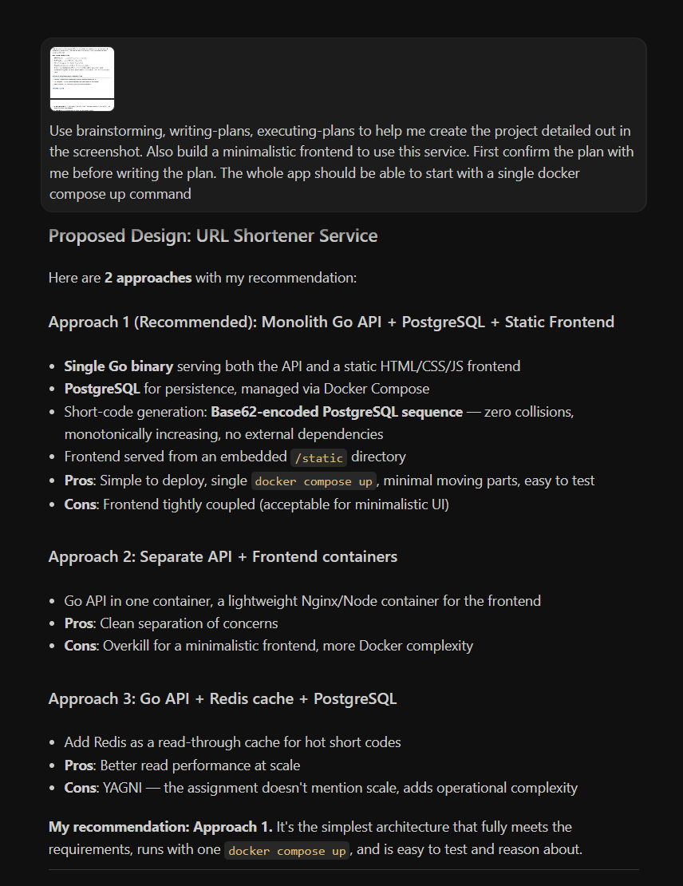
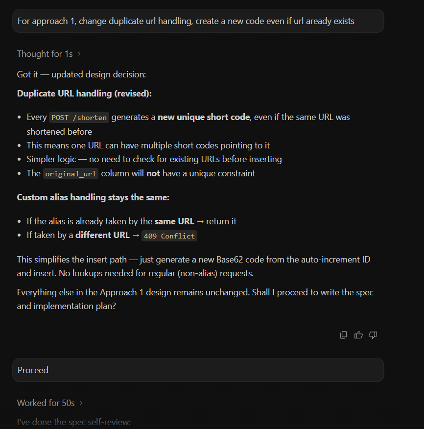
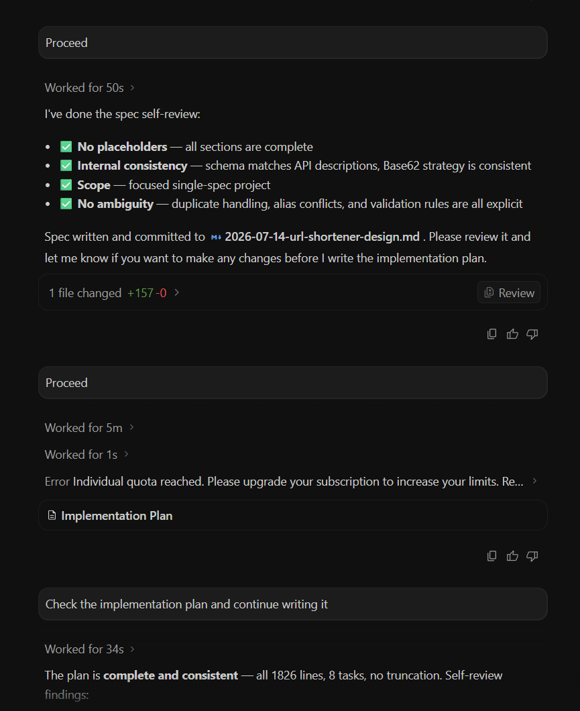
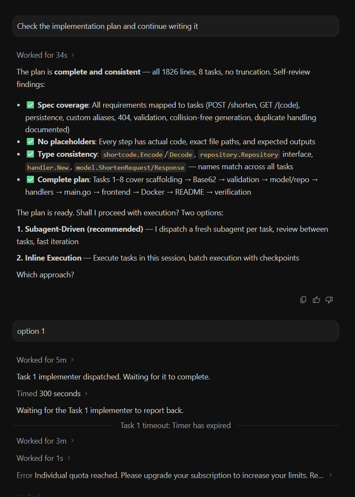
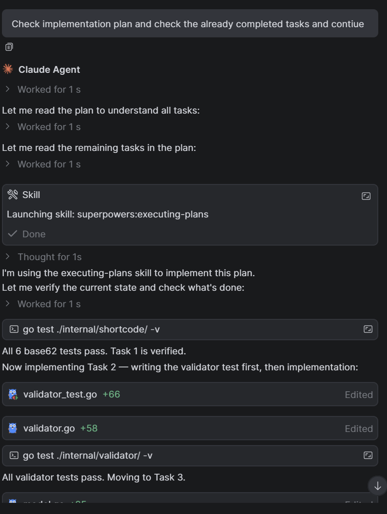
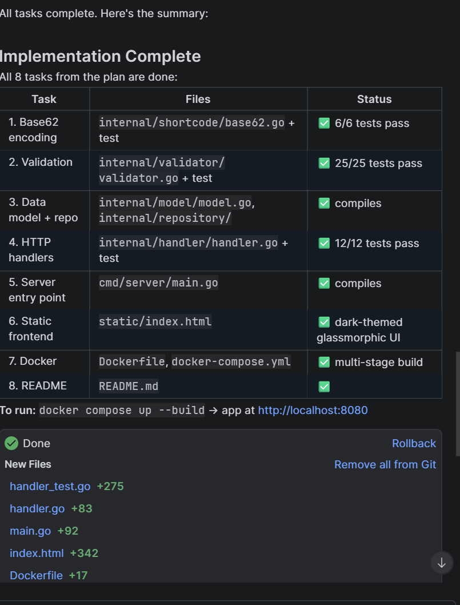

# Write UP

## 1. What did you ask the AI to do, and what did you write or decide yourself?

The AI was asked to create the entire project. I created the project folder and added the obra superpowers plugin. I asked the AI to use the brainstorming, writing-plans and executing-plans skills to help me create the project. I reviewed the spec which was provided after brainstorming. The spec was feasible for our project, so I gave a go ahead and it started writing the plan. After the plan was written, I reviewed the whole plan and then it proceeded to implement the plan. After implementing the plan (the whole code). I ran and checked the app to see if it is performing the required features.

## 2. Where did you override, correct, or throw away the AI’s output — and why?
After the spec was finalized, (after brainstorming) I noticed that it has chosen to keep url idempotent. Implying it will return the same short code if url already exists. I wanted to change that to make it generate short code for every valid url even if the url exists. So I gave the prompt to remove this idempotency. As for the reason why I chose this, I have mentioned it in the 3rd point.

## 3. The two or three biggest trade-offs you made, and the alternatives you considered.
The first was I chose not to keep url idempotent. Since the assignment title contained "Link Analytics", I thought that the url idempotency was not necessary. E.g. If we need to keep track of from where our customer landed to our website, we might need the non-idempotency nature. Secondly, I skipped the caching of GET requests. Given the scope of this assignment, I decided not to. But it can be added easily which might improve the performance when hosted. Thirdly, I chose Base62 Encoding + counter approach to prevent collisions.

## 4. What’s missing, or what you’d do with another day?
Since I was able to complete the assignment quickly, I spent my time on working on my currently ongoing RAG based AI Agent Project

## The AI Tech Stack

| AI Integrated IDE | LLMs Used                           | Tasks performed                                                                                                                                                                                                       |
|-------------------|-------------------------------------|-----------------------------------------------------------------------------------------------------------------------------------------------------------------------------------------------------------------------|
| Antigravity       | Claude Opus 4.8                     | Used for initial brain storming, writing-plans and executing plans. Some tasks were successfully executed. Free limit got finished so had to move to other free options                                               |
| Intellij Goland   | Claude Sonnet 4.6, Claude Haiku 4.5 | Since the plan was already finalized, changing models did not introduce problems. Used for completing the remaining tasks. But limit finished just before the last documentation so had to move to other free options |
                                                                                                                                                                    |

## Prompts

I have used opra superpowers open source skills plugin for using AI efficiently for the project. Some of the prompts that I have used:

1. "`Use brainstorming, writing-plans, executing-plans to help me create the project detailed out in the screenshot. Also build a minimalistic frontend to use this service. First confirm the plan with me before writing the plan. The whole app should be able to start with a single docker compose up command`"
2. "`For approach 1, change duplicate url handling, create a new code even if url aready exists`"

Most of the responses from the LLMs were just approaches and plans which I needed to review and provide feedback if necessary

### Screenshots:
1. 
2. 
3. 
4. 
4. 
4. 